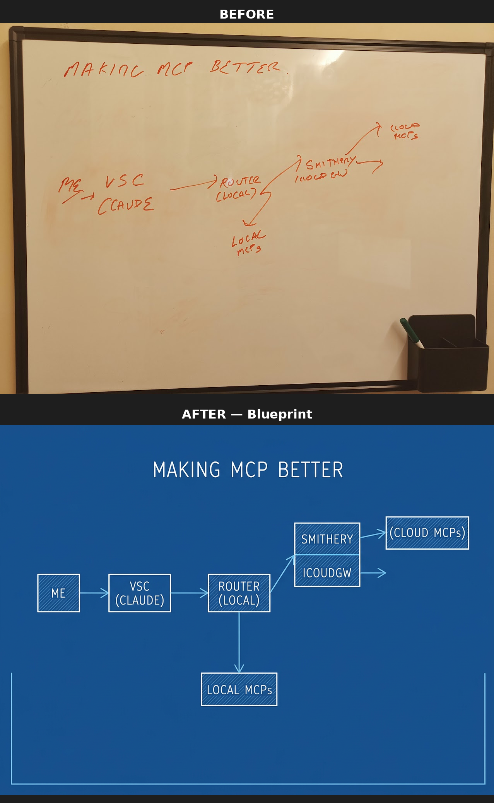
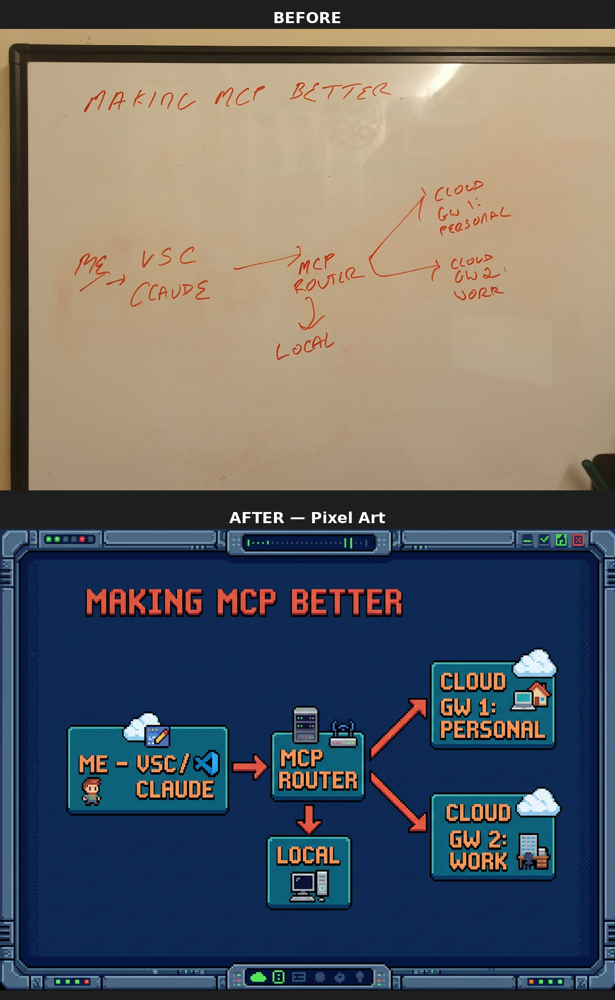

# Sample Whiteboards

A collection of example whiteboard photos for testing AI image-to-image tools and processes for whiteboard-to-tech-diagram cleaning -- a workflow I love!

## Structure

- `whiteboards/` -- Raw whiteboard photos
- `graphics/` -- Cleaned/polished output diagrams
- `comparisons/` -- Before/after comparison images
- `scripts/` -- Processing scripts
- `prompts/` -- Prompt templates for different styles

## Before & After Examples

Each whiteboard was processed with a different style prompt to showcase the range of outputs:

### Chalkboard Style


### Blueprint Style


### Pixel Art Style


### Neon Sign Style


### Corporate Clean Style


## Baseline Prompt

All style prompts share a common foundation. The baseline instructions are:

> Take this whiteboard photograph and convert it into a beautiful and polished graphic featuring clear labels and icons. Remove the physical whiteboard, markers, frame, and any background elements -- output only the diagram on a clean white background. Correct any perspective distortion so the output appears as a perfectly straight-on, top-down view regardless of the angle the original photo was taken from. Preserve all the original content, text, and diagrams. When reading handwritten text, infer the correct spelling of technical terms, product names, and proper nouns rather than transcribing handwriting literally (e.g. "Proxmox" not "Proxknox", "Kubernetes" not "Kubernites"). Keep the user's handwriting style and character but make it more legible and well-organized. The result should be a fully representative version of the whiteboard content that is much more visually attractive and easy to understand than the original photo.

Each style variant modifies the background, rendering style, and aesthetic while preserving these core instructions.

## Prompt Index

28 style prompts across 6 categories, all using [Fal AI's Nano Banana 2](https://fal.ai) image-to-image model.

### Creative

| Prompt | Description |
|--------|-------------|
| [Colorful Infographic](prompts/creative/colorful-infographic.md) | Bold, vibrant infographic -- blog hero, social media explainer |
| [Comic Book](prompts/creative/comic-book.md) | Comic book / graphic novel panel -- XKCD meets Marvel |
| [Isometric 3D](prompts/creative/isometric-3d.md) | Isometric 3D illustration -- product landing page, AWS diagram |
| [Neon Sign](prompts/creative/neon-sign.md) | Glowing neon tubes on dark brick wall -- cyberpunk aesthetic |
| [Pastel Kawaii](prompts/creative/pastel-kawaii.md) | Soft pastel / cute Japanese illustration -- Hobonichi planner style |
| [Pixel Art](prompts/creative/pixel-art.md) | Retro 16-bit pixel art -- SimCity UI, indie game devlog |
| [Stained Glass](prompts/creative/stained-glass.md) | Cathedral stained glass window -- art nouveau, jewel tones |
| [Sticky Notes](prompts/creative/sticky-notes.md) | Kanban / sticky note board -- Miro board, design sprint output |
| [Watercolor Artistic](prompts/creative/watercolor-artistic.md) | Watercolor painting -- illustrated travel journal, art book |

### Professional

| Prompt | Description |
|--------|-------------|
| [Blog Hero](prompts/professional/blog-hero.md) | Blog featured image -- Medium header, Substack, 16:9 composition |
| [Corporate Clean](prompts/professional/corporate-clean.md) | Minimalist corporate slide-ready -- consulting deliverable, investor deck |
| [Hand-Drawn Polished](prompts/professional/hand-drawn-polished.md) | Refined sketch -- Moleskine notebook, design thinking output |
| [Minimalist Mono](prompts/professional/minimalist-mono.md) | Black and white minimalist -- academic paper figure, Bauhaus |
| [Ultra Sleek](prompts/professional/ultra-sleek.md) | Ultra-refined thin lines -- Swiss design, Apple keynote diagram |

### Technical

| Prompt | Description |
|--------|-------------|
| [Blueprint](prompts/technical/blueprint.md) | Architectural blueprint -- deep blue background, drafting font |
| [Dark Mode Technical](prompts/technical/dark-mode-technical.md) | Dark background engineering aesthetic -- terminal-style documentation |
| [Flat Material](prompts/technical/flat-material.md) | Google Material Design / flat UI -- Android app mockup style |
| [GitHub README](prompts/technical/github-readme.md) | GitHub-native markdown-friendly -- repo architecture overview |
| [Photographic](prompts/technical/photographic.md) | Photorealistic 3D render -- glass, metal, acrylic materials |
| [Terminal Hacker](prompts/technical/terminal-hacker.md) | Green-on-black terminal -- Matrix, phosphor CRT look |
| [Visionary Inspirational](prompts/technical/visionary-inspirational.md) | Cosmic / futurist keynote -- SpaceX mission slide, sci-fi UI |

### Retro & Fun

| Prompt | Description |
|--------|-------------|
| [Chalkboard](prompts/retro-fun/chalkboard.md) | Classic green chalkboard -- university lecture, TED talk |
| [Eccentric Psychedelic](prompts/retro-fun/eccentric-psychedelic.md) | Psychedelic maximum saturation -- concert poster, album art |
| [Mad Genius](prompts/retro-fun/mad-genius.md) | Chaotic genius / beautiful mind -- conspiracy wall, inventor's notebook |
| [Retro 80s](prompts/retro-fun/retro-80s.md) | Synthwave / neon 1980s -- Tron, retro arcade aesthetic |
| [Woodcut](prompts/retro-fun/woodcut.md) | Medieval woodcut / linocut print -- Gutenberg, vintage textbook |

### Language

| Prompt | Description |
|--------|-------------|
| [Bilingual Hebrew](prompts/language/bilingual-hebrew.md) | English + Hebrew labels side by side |
| [Translated Hebrew](prompts/language/translated-hebrew.md) | Fully translated to Hebrew, RTL layout |

## Processing Script

`scripts/clean_whiteboards.py` uses Fal AI's Nano Banana 2 to convert whiteboard photos into clean diagrams.

### Usage

```bash
# Set your Fal AI API key
export FAL_API_KEY="your-key-here"

# Install dependency
pip install requests

# Run with default prompt (all images)
python3 scripts/clean_whiteboards.py

# Run a specific image with a specific style
python3 scripts/clean_whiteboards.py --image whiteboards/photo.jpg --prompt-file prompts/creative/neon-sign.md
```

The script processes images in `whiteboards/` and saves cleaned versions to `graphics/`. It can also pick up the API key from `~/.config/nano-whiteboard-doctor/config.json` if you have [Nano Whiteboard Doctor](https://github.com/danielrosehill/Nano-Whiteboard-Doctor) configured.

`scripts/create_comparisons.py` generates before/after comparison images stacked vertically, saved to `comparisons/`.
